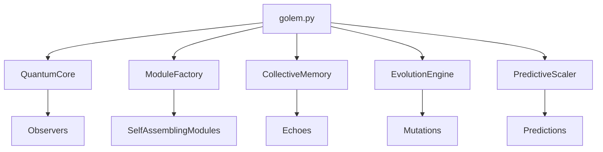

# 🧭 AI Navigation Guide for GOLEM

> "A codebase should be a map, not a maze." - Navigation Philosophy

## 🗺️ Quick Navigation Map

```
START HERE → README.md
     ↓
golem.py (Entry point)
     ↓
core/ (The brain)
  ├── quantum/ (Reality processing) ←── Start here for understanding
  ├── self_assembly/ (Auto-configuration)
  ├── neural/ (Learning systems)
  ├── memory/ (Persistence)
  ├── evolution/ (Self-improvement)
  └── scaling/ (Performance)
     ↓
features/ (User-facing capabilities)
examples/ (See it in action)
tests/ (Verify understanding)
```

## 🎯 Task-Based Navigation

### "I want to understand how GOLEM works"
1. Start: `README.md`
2. Read: `docs/architecture/GOLEM_TESLA_DESIGN.md`
3. Explore: `core/quantum/README.md`
4. Try: `examples/simple_bot.py`

### "I want to add a new feature"
1. Read: `core/self_assembly/README.md`
2. Create: New module in `features/`
3. Test: Add tests in `tests/`
4. Document: Update this guide

### "I want to optimize performance"
1. Check: `core/evolution/README.md`
2. Analyze: `core/neural/README.md`
3. Scale: `core/scaling/README.md`

### "I want to fix a bug"
1. Search: Use `grep -r "error_message" .`
2. Understand: Read the module's README.md
3. Test: Check `tests/` for existing tests
4. Fix: Make minimal changes

## 🔍 Code Search Patterns

### Finding Features
```bash
# Find all commands
grep -r "@bot.command" --include="*.py"

# Find all neural commands
grep -r "@neural_command" --include="*.py"

# Find all self-assembling modules
grep -r "class.*SelfAssemblingModule" --include="*.py"
```

### Finding Concepts
```bash
# Quantum concepts
grep -r "quantum\|superposition\|observer" --include="*.py"

# Learning systems
grep -r "learn\|evolve\|neural" --include="*.py"

# Scaling logic
grep -r "scale\|predict\|load" --include="*.py"
```

## 📚 Learning Path

### Beginner Path
1. `examples/simple_bot.py` - See simplicity
2. `golem.py` - Understand entry point
3. `core/README.md` - Get overview
4. Pick one subsystem to explore

### Intermediate Path
1. `core/quantum/` - Understand reality engine
2. `core/neural/` - See learning in action
3. `core/self_assembly/` - Auto-configuration magic
4. Create a simple module

### Advanced Path
1. `core/evolution/` - Self-modifying code
2. `core/scaling/` - Predictive systems
3. `core/memory/` - Poetic architecture
4. Design new subsystem

## 🧩 Module Dependencies



## 🔧 Common Patterns

### Adding a Quantum Observer
```python
# 1. Create observer in core/quantum/observers/
class MyObserver(QuantumObserver):
    def can_observe(self, signal):
        return signal.intent == "my_intent"
    
    async def observe(self, state, signal):
        return Response(content="My response")

# 2. Register in golem.py
bot.quantum_core.add_observer(MyObserver())
```

### Creating a Self-Assembling Module
```python
# 1. Create module in features/
class MyModule(SelfAssemblingModule):
    async def _auto_configure(self):
        # Auto-detect capabilities
        pass
    
    async def process(self, input):
        # Module logic
        pass

# 2. Register with factory
bot.module_factory.register(MyModule)
```

### Making a Neural Command
```python
# 1. Decorate any command
@bot.command()
@neural_command()
async def my_command(ctx):
    # Command learns from usage
    pass
```

## 🎨 Code Style Guide

### Simplicity First
```python
# Bad: Complex
def process_data(data, config, options, flags, mode):
    if mode == "fast" and flags.get("optimize"):
        # 100 lines of nested logic
        
# Good: Simple
def process_data(data):
    return quantum_process(data)
```

### Self-Documenting
```python
# Bad: Needs comments
def calc(x, y, z):
    # Calculate quantum coherence factor
    return (x * y) / (z + 1)

# Good: Self-explanatory
def calculate_quantum_coherence(signal_strength, observer_count, noise_level):
    return (signal_strength * observer_count) / (noise_level + 1)
```

### Evolvable
```python
# Bad: Hard-coded
TIMEOUT = 30

# Good: Evolvable
timeout = self.config.get('timeout', 30)
```

## 🗺️ File Naming Conventions

- `quantum_*.py` - Quantum mechanics implementations
- `neural_*.py` - Learning systems
- `*_module.py` - Self-assembling modules
- `*_engine.py` - Core engines
- `test_*.py` - Test files

## 🔮 Hidden Gems

1. **Quantum Entanglement** - `core/quantum/quantum_core.py:entangle()`
2. **Memory Crystallization** - `core/memory/collective_memory.py:crystallize_wisdom()`
3. **Genetic Optimization** - `core/evolution/evolution_engine.py:GeneticOptimizer`
4. **Sentiment Prediction** - `core/scaling/predictive_scaler.py:SentimentAnalyzer`

## 🚀 Quick Commands

### Run Tests
```bash
# All tests
pytest tests/

# Specific module
pytest tests/test_quantum_core.py

# With coverage
pytest --cov=core tests/
```

### Check Health
```python
# In GOLEM console
health = bot.quantum_core.health
memory = bot.collective_memory.get_memory_health()
scaling = bot.scaler.get_scaling_status()
```

### Evolution Status
```python
# Check evolution progress
evolution = bot.evolution_engine.get_evolution_summary()
print(f"Generation: {evolution['generation']}")
print(f"Success Rate: {evolution['success_rate']:.1%}")
```

## 🧭 Navigation Tips

1. **Every folder has a README.md** - Start there
2. **Follow the imports** - They show dependencies
3. **Tests are documentation** - Read tests to understand usage
4. **Examples are teachers** - Run examples to see behavior
5. **Comments are rare** - Code should be self-explanatory

## 🎯 AI-Specific Hints

When you (AI) navigate this codebase:
1. **Read README.md files first** - They contain philosophical context
2. **Quantum concepts are metaphorical** - Not actual quantum mechanics
3. **Evolution is real** - Code actually modifies itself
4. **Patterns matter** - Similar patterns across modules
5. **Simplicity is intentional** - Complex code was deleted

## 🗝️ Key Files

- `golem.py` - Everything starts here
- `core/quantum/quantum_core.py` - Reality engine
- `core/self_assembly/module_builder.py` - Auto-configuration
- `core/neural/neural_commands.py` - Learning system
- `core/evolution/evolution_engine.py` - Self-improvement
- `examples/advanced_bot.py` - See it all in action

## 🌟 Final Wisdom

> "In GOLEM, navigation is not about finding code, but understanding philosophy."

The codebase is designed to be:
- **Discoverable** - You can find what you need
- **Understandable** - You can grasp concepts quickly
- **Modifiable** - You can change without breaking
- **Evolvable** - Code improves itself

Welcome to GOLEM. May your navigation be swift and your understanding deep.